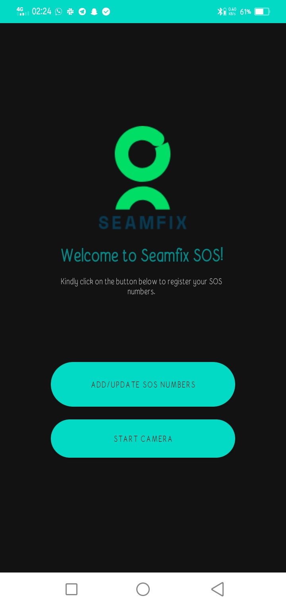
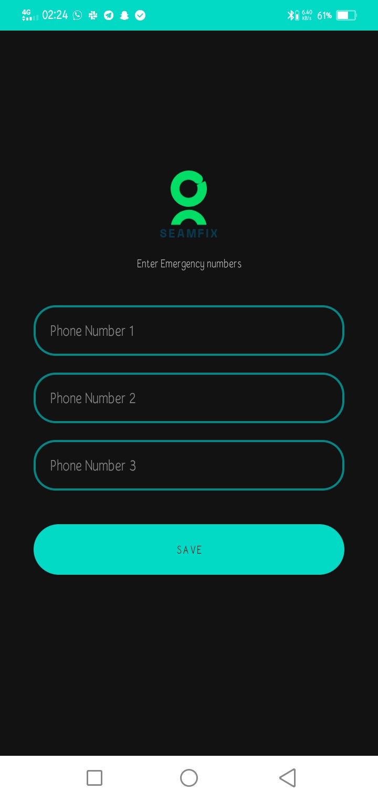
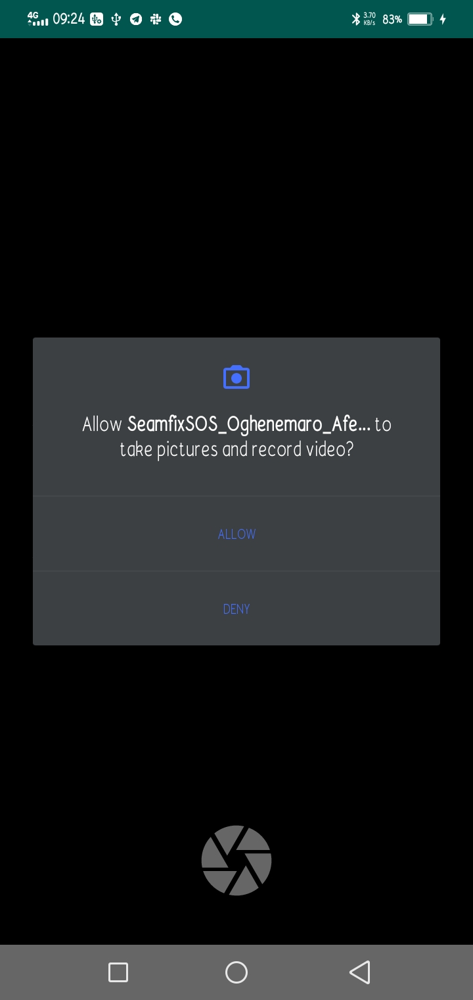
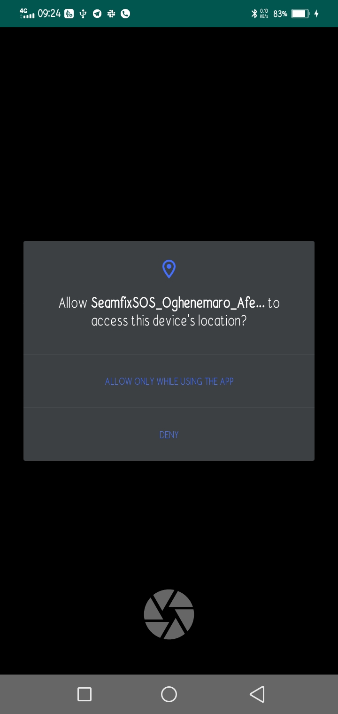
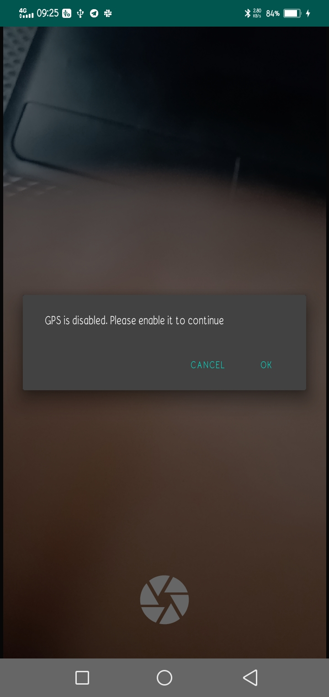
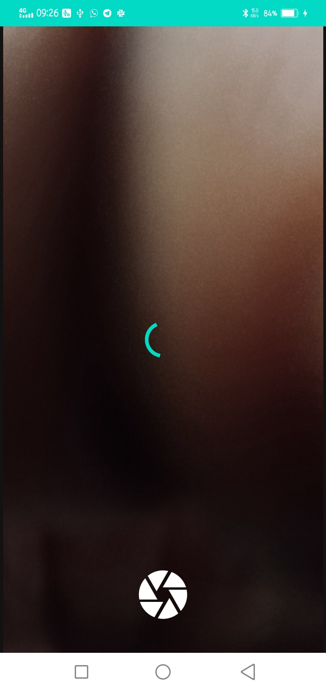

# SeamfixSOS

The SeamfixSOS app is a great way to securely send information of your current location when you have reasons to believe that you are in distress.
The app allows users take photos of their current location. The image captured is sent along with live location data and predefined SOS numbers to a secure 
database.
## Features

The project uses the following

* Retrofit for API integration,
* Google location API for live location information,
* CameraView Api for image capturing

The app checks to see if the user's GPS service is turned on when the user opens up the camera activity and if it is not, the user is asked to turn on the GPS before they can continue as the user cannot upload GPS details without granting access to the current location of the user.

The app tracks the user's location in real time and new GPS information(longitude and latitude) is collected.

On image capture, the photo is converted to a base64 string while the app displays a loading screen during the time that the user's photo(as a base64 string) and location is uploaded. When the opload is complete, a toast message is shown on the screen and the camera activity restored in case the user intends to take another photo.

Screenshots of the project in night mode:

